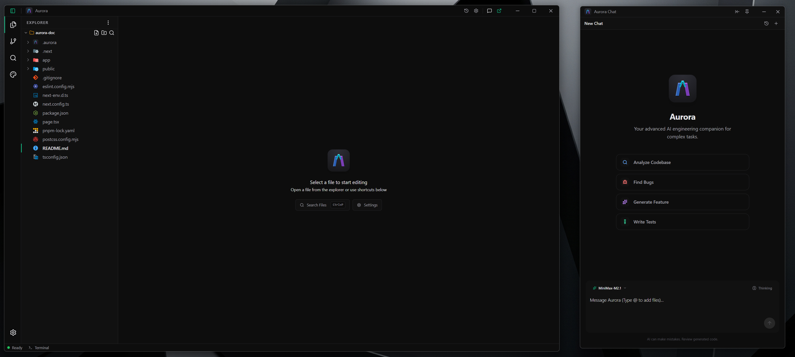
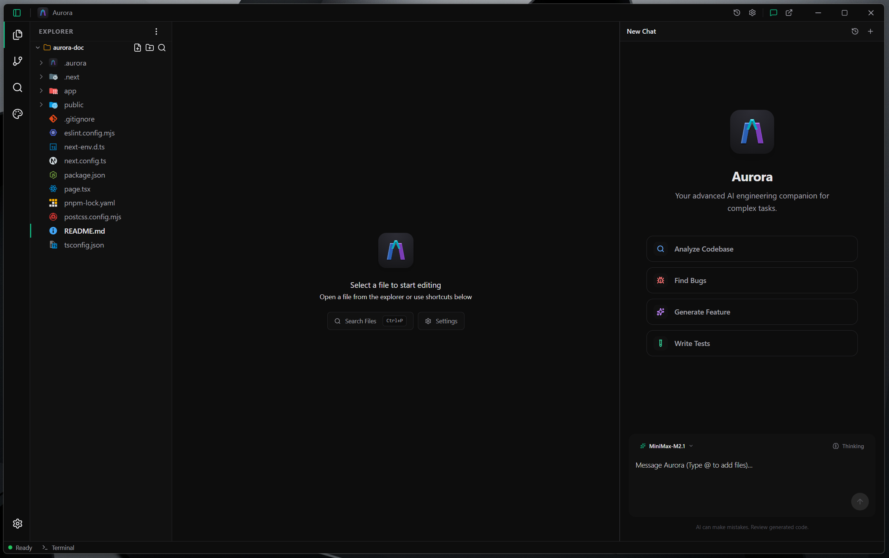

# Aurora Agent ⭐

> 🚀 **Initial Release Available Now!**
>
> Download the exe and start using it guys! The codebase will be shared soon.
>
> 📦 **[Aurora_0.1.0_x64-setup.exe](assets/Aurora_0.1.0_x64-setup.exe)** - Download & Run!

---

An AI-powered agentic code editor that combines the familiarity of VS Code with advanced AI assistance capabilities.

## Preview

### Agent Interface

### IDE Interface

## Overview

Aurora Agent is a next-generation code editor built on a robust Rust backend with a modern React frontend. It provides a VS Code-like interface enhanced with an intelligent AI assistant that can execute tools to manipulate files, run commands, navigate workspaces, and perform semantic code search.

## Key Features

- **AI-Powered Assistant**: Integrated AI agent capable of understanding context and executing complex coding tasks
- **Advanced File Operations**: Create, edit, search, and manage files with intelligent assistance
- **Command Execution**: Run shell commands and scripts directly from the editor
- **Semantic Code Search**: Powerful search engine using AI embeddings for finding code by meaning
- **Workspace Navigation**: Intelligent file exploration and project management
- **Task Management**: Built-in todo list and task tracking functionality
- **Customizable Interface**: VS Code-inspired design with theme support and customizable layouts

## Technology Stack

### Frontend
- React 18.3.1 with TypeScript
- Vite 7.2.4 for fast development and building
- Monaco Editor for professional code editing experience
- Zustand for efficient state management
- Tailwind CSS for modern, responsive styling

### Backend
- Rust with Tauri 2.x for native performance
- SQLite database for persistent state management
- Advanced semantic search engine with ONNX embeddings
- Integrated terminal with PTY support
- Comprehensive file system operations

## Architecture

Aurora Agent features a three-panel layout similar to popular code editors:
- **File Explorer** (18%): Navigate and manage your project structure
- **Editor Panel** (57%): Main coding area with tabbed interface
- **Chat Panel** (25%): AI assistant interface with conversation history

The AI assistant can execute over 20 different tools including file operations, shell commands, workspace management, and semantic search, making it capable of handling complex development tasks autonomously.

## Coming Soon

Aurora Agent is currently in development and will be releasing soon. Stay tuned for updates on our official channels.
